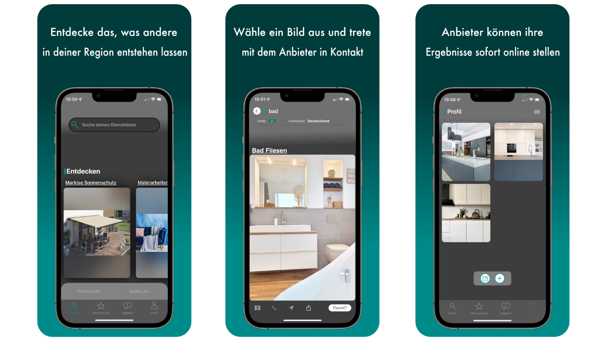

Im Laufe der Zeit hatte ich immer wieder den Wunsch nach neuen Herausforderungen. Nach Herausforderungen die auch für mich persönlich einen sinnvollen Zweck in meinem Leben darstellen sollten. Hinzu kam noch, das ich die Leidenschaft und das Teamwork vermisse, was ich mit dem Projekt WMS und als Inhouse Consultant erfahren habe. Schon damals hatte ich eine gewisse Affinität für IT. Für mich persönlich hatte die Softwareentwicklung immer etwas von Magie 🪄. Dinge erschaffen zulassen, nur mit seinen Gedanken und diese dann Wirklichkeit werden zu lassen. Evtl. sogar das Leben von Menschen positiv beeinflussen, einfach um einen Mehrwert zu schaffen. Mein innerlicher Wunsch, programmieren zu können, wurde immer und immer größer. Da ich ein Fable für schöne Designs und Apple Produkten 📱👨🏻‍💻 habe, kam ich zu dem Entschluss mir die Programmiersprache Swift anzueignen.  Meine Apple-Sammlung (iPhone, MacBook, iPad) vereinfachten mir die Entwicklung und das Testen der App.

## Ein Autodidakt 
---
Zu Beginn startete ich mit Playground von Apple. Ich wollte wissen, ob es mir überhaupt möglich ist, das Programmieren zu verstehen. Das es mir gelungen ist, sehen Sie an meiner Homepage. Als nächsten Schritt, habe ich ein größeres Projekt von der Platform Udemy nachgebaut, was ebenfalls funktionierte. Erst anschließend habe ich mich an meine eigene App gewagt. Der Prozessablauf, das Design, eben alles was dazu gehört, wurde in Eigenregie entwickelt. Entstandene Fehler in der Programmierung wurden von mir selbstständig behoben -  im Notfall wurde im Netz oder im Buch nach Lösungsansätze recherchiert. Die Entwicklung hatte neben dem Job und der Familie stattgefunden. Das heißt konkret, die Mittagspause wurde genutzt, sowie die späten Abendstunden, die auch manchmal bis 23 Uhr gingen. Um Familie, Arbeit und das Programmieren unter einen Hut zubekommen, musste ich meinen Schlaf auf ein absolutes Minimum von 6 Stunden reduzieren. Selbst das Wochenende und zum Teil der Urlaub wurde fürs Programmieren genutzt. Das die App nun fertig ist und sie in TestFlight zur Verfügung steht, macht mich sehr glücklich. Eigenständig soweit gekommen zu sein, erfüllt mich mit sehr viel Stolz.

## Die App
---

Das Prinzip der App ist einfach, es handelt sich um eine „Two-Sided Platform“ aus Anbieter und Nachfrager. Die App ist einfach aufgebaut, aus klassischen Posts, theoretisch erstellt von kleinen regionalen Betrieben. Das Ganze soll wie eine Anzeige im regionalen Gemeindeblatt oder auch in der regionalen Zeitung wirken. Noch dazu mit Bild, Navigation und Kontaktaufnahme per Telefon und Mail. Der Clou dabei, im Vordergrund steht das Produkt des Anbieters. Das Unternehmen selbst wird in der App nicht gesucht, sondern lediglich das gesuchte Produkt oder die Dienstleistung. Es gibt keine „Likes“ oder Kommentare - alleine das Bild entscheidet!

Der Ansatz ist ganz einfach zu verstehen. Gibt man in Google z. B. „Bad grau Dachschräge“ ein, werden ca. 258.000 Ergebnisse aufgeführt. Man findet auf den ersten Blick keinen Dienstleister in seiner Nähe! Mit der App finden Sie einen solchen auf den ersten Klick, da man bereits vor seiner Suche PLZ und Radius eintragen / einspeichern kann.
Als Referenz entscheidet einzig und alleine - bei meiner App - das Bild! Wie heißt es so schön: Ein Bild sagt mehr als 1.000 Worte…

Wenn Sie die App gerne testen möchten, um meine Programmierfähigkeiten unter die Lupe nehmen zu können, schreiben Sie mir doch gerne eine [E-Mail](mailto:mail@sebastian-schm1tt.com) und ich schicke eine Einladung für TestFlight. Natürlich freue ich mich auch über jedes ehrliche und konstruktive Feedback
